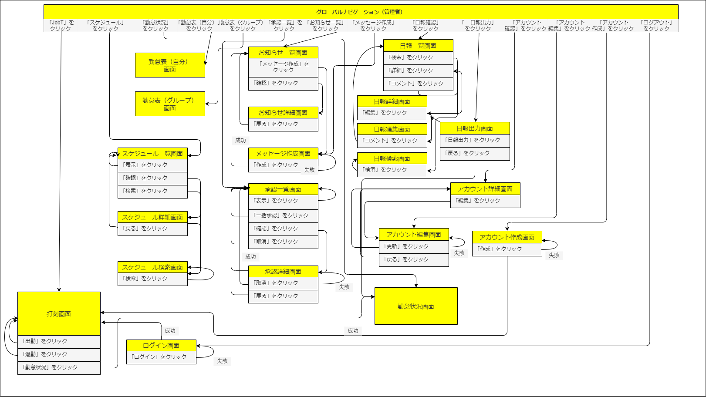

# README
# 開発言語
- Ruby 3.0.1
- Rails 6.0.4.8
# 実行手順
    $ git@github.com:yoshihiro-kawabata/JobT.git
    $ cd JobT
    $ bundle install
    $ rails db:create && rails db:migrate
    $ rails s
# カタログ設計
https://docs.google.com/spreadsheets/d/1LXGPALHgtO5AsFpGhZqvteM7tUVq_3hKYmIOLQhmniU/edit?usp=sharing
# テーブル定義書
https://docs.google.com/spreadsheets/d/1LXGPALHgtO5AsFpGhZqvteM7tUVq_3hKYmIOLQhmniU/edit?usp=sharing
# ワイヤーフレーム
https://docs.google.com/spreadsheets/d/1LXGPALHgtO5AsFpGhZqvteM7tUVq_3hKYmIOLQhmniU/edit?usp=sharing
# ER図

# 画面遷移図(一般ユーザ)

# 画面遷移図(管理者ユーザ)

